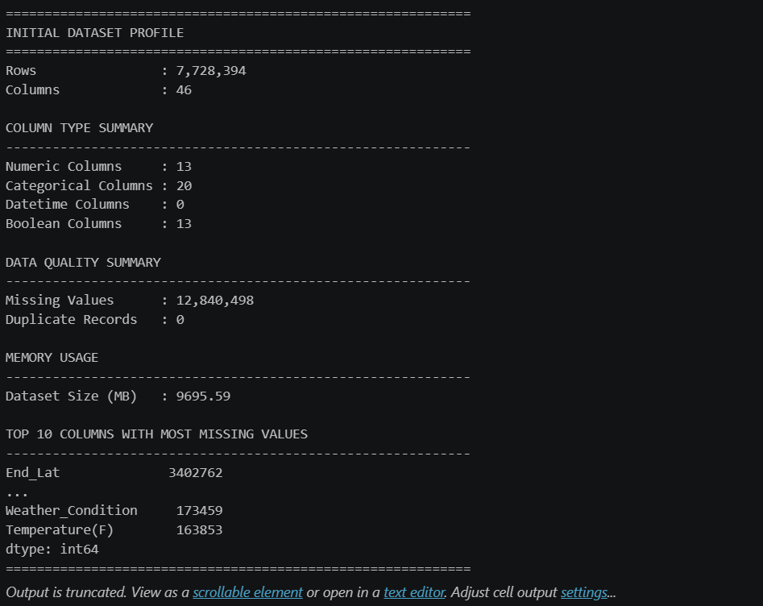
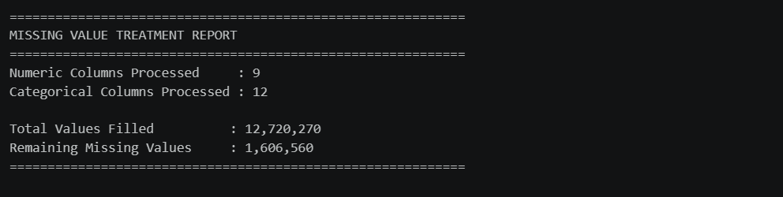
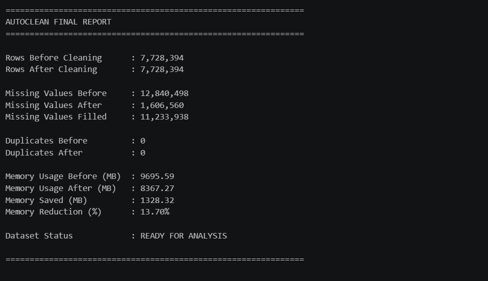

# AutoClean - Automated Data Cleaning Framework

## Overview

AutoClean is a reusable Python-based data cleaning framework that automates common data quality tasks across structured datasets.

Unlike dataset-specific cleaning scripts, AutoClean applies data-type-driven cleaning rules, making it adaptable to datasets from various domains such as transportation, healthcare, finance, HR, telecommunications, and e-commerce.

The framework was validated using the **US Accidents Dataset containing 7.7+ million records**, demonstrating its ability to handle large-scale datasets efficiently.

---

## Table of Contents

- [Overview](#overview)
- [Project Structure](#project-structure)
- [Tech Stack](#tech-stack)
- [Features](#features)
- [Workflow](#workflow)
- [Data Cleaning Logic](#data-cleaning-logic)
  - [Column Standardization](#column-standardization)
  - [Date Detection & Conversion](#date-detection--conversion)
  - [Missing Value Treatment](#missing-value-treatment)
  - [Duplicate Removal](#duplicate-removal)
  - [Text Standardization](#text-standardization)
  - [Outlier Handling](#outlier-handling)
- [Project Results](#project-results)
- [Screenshots](#screenshots)
- [How to Run](#how-to-run)
- [Requirements](#requirements)
- [License](#license)
- [Future Enhancements](#future-enhancements)
- [Author](#author)

---

## Project Structure

```text
AutoClean - Automated Data Cleaning Framework/
│
├── .gitignore
├── LICENSE
├── README.md
├── requirements.txt
│
├── notebooks/
│   └── AutoClean.ipynb
│
├── images/
│   ├── initial_data_profile.png
│   ├── missing_values_report.png
│   └── final_report.png
│
├── reports/
│   └── autoclean_report.xlsx
│
├── data/
│   ├── raw/
│   └── cleaned/
```

---

## Tech Stack

<p align="left">
  
  
  
  
  
</p>

---

## Features

- Automated dataset profiling
- Dynamic column standardization
- Automatic date column detection
- Data-type-based missing value treatment
- Duplicate record removal
- Text standardization
- IQR-based outlier handling
- Automated data quality reporting
- Clean dataset export
- Excel report generation
- Reusable across multiple datasets

---

## Workflow

```text
Load Dataset
      ↓
Initial Dataset Profiling
      ↓
Column Standardization
      ↓
Date Detection & Conversion
      ↓
Missing Value Treatment
      ↓
Duplicate Removal
      ↓
Text Standardization
      ↓
Outlier Handling (IQR)
      ↓
Final Dataset Profiling
      ↓
Data Quality Report
      ↓
Export Clean Dataset
```

---

# Data Cleaning Logic

## Column Standardization

AutoClean standardizes column names by:

- Removing leading spaces
- Removing trailing spaces
- Converting names to lowercase
- Replacing spaces with underscores

### Example

**Before**

```text
Customer ID
Join Date
Weather Condition
```

**After**

```text
customer_id
join_date
weather_condition
```

---

## Date Detection & Conversion

The framework automatically detects date columns without requiring predefined column names.

### Detection Logic

A column is treated as a date column when:

```text
80% or more values can be converted to datetime format
```

### Example

```text
01/01/2024
2024-01-02
Jan 03 2024
```

Converted to:

```python
datetime64[ns]
```

---

## Missing Value Treatment

Missing values are handled based on data type.

### Numeric Columns

The framework calculates skewness for each numeric column.

#### Mean Imputation

Used when data is approximately symmetric.

```text
|Skewness| < 0.5
```

Examples:

- Age
- Temperature
- Visibility

#### Median Imputation

Used when data is skewed.

```text
|Skewness| ≥ 0.5
```

Examples:

- Income
- Sales
- Transaction Amount

Median is preferred because it is less sensitive to extreme values.

---

### Categorical Columns

Missing values are filled using:

```text
Mode (Most Frequent Value)
```

Examples:

- City
- Department
- Weather Condition

---

### Date Columns

Date columns are intentionally excluded from automatic imputation.

**Reason:**

Missing dates represent unknown information.

Automatically filling dates can introduce incorrect temporal information into the dataset.

Therefore:

```text
Date Missing Values → Retained as Null
```

---

## Duplicate Removal

Duplicate records are detected using:

```python
df.duplicated()
```

and removed using:

```python
df.drop_duplicates()
```

This prevents duplicate records from affecting downstream analysis.

---

## Text Standardization

Text columns are cleaned by:

- Removing leading spaces
- Removing trailing spaces
- Removing multiple spaces
- Converting text to title case

### Example

**Before**

```text
" NEW YORK "
"new york"
"NEW YORK"
```

**After**

```text
New York
New York
New York
```

---

## Outlier Handling

AutoClean uses the Interquartile Range (IQR) Method.

### Formula

```text
IQR = Q3 - Q1

Lower Bound = Q1 - (1.5 × IQR)

Upper Bound = Q3 + (1.5 × IQR)
```

### Treatment Strategy

Instead of deleting records, AutoClean caps extreme values at the calculated boundaries.

### Benefits

- Preserves dataset size
- Reduces impact of extreme values
- Maintains analytical consistency

---

# Project Results

## Dataset Used

**US Accidents Dataset**

- Records: 7,728,394
- Columns: 46

---

## AutoClean Final Report

| Metric | Result |
|----------|----------:|
| Rows Before Cleaning | 7,728,394 |
| Rows After Cleaning | 7,728,394 |
| Missing Values Before | 12,840,498 |
| Missing Values After | 1,606,560 |
| Missing Values Filled | 11,233,938 |
| Duplicate Records Removed | 0 |
| Memory Usage Before (MB) | 9,695.59 |
| Memory Usage After (MB) | 8,367.27 |
| Memory Saved (MB) | 1,328.32 |
| Memory Reduction (%) | 13.70% |

### Key Achievements

✅ Filled **11.2+ million missing values**

✅ Reduced memory usage by **1.3 GB**

✅ Automated profiling and quality assessment

✅ Generated analysis-ready dataset

✅ Exported cleaning reports automatically

**Dataset Status: READY FOR ANALYSIS**

---

# Screenshots

## Initial Dataset Profile



---

## Missing Value Treatment Report



---

## Final AutoClean Report



---

# How to Run

### Clone Repository

```bash
git clone https://github.com/yourusername/AutoClean-Data-Cleaning-Framework.git
```

### Navigate to Project Directory

```bash
cd AutoClean-Data-Cleaning-Framework
```

### Install Dependencies

```bash
pip install -r requirements.txt
```

### Launch Jupyter Notebook

```bash
jupyter notebook
```

Open:

```text
notebooks/AutoClean.ipynb
```

Run all cells.

---

# Requirements

```text
pandas
numpy
openpyxl
jupyter
```

---

# License

This project is licensed under the MIT License.

See the [LICENSE](LICENSE) file for details.
---

# Future Enhancements

- Automated anomaly detection
- Data validation rules
- Schema comparison
- HTML quality reports
- Interactive dashboard integration
- Support for additional file formats
- Package deployment via PyPI

---

# Author

## Vishal Ramane

**Data Analyst | Python | SQL | Power BI | Machine Learning**

### Connect

- LinkedIn: www.linkedin.com/in/vishal-ramane
- GitHub: https://github.com/vishalramane
- Email: vishalramane.work@gmail.com

If you found this project useful, consider giving it a ⭐ on GitHub.